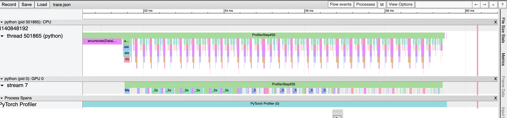
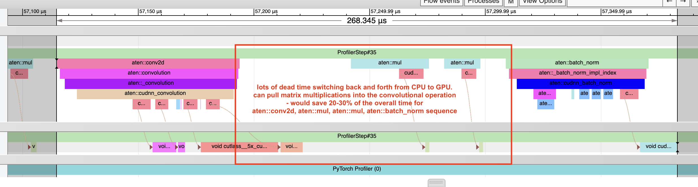

## Task 1: hyperparameter tuning


notes: 
- on Cifar + resnet, started with the lottery model, on which training loops seems to take about 20s each on the ionic machines
  - Note that there is no default model on resnet20 - this is useful to notice. 


Cifar10, ResNet20, RAND pruning
- lottery model
- compression 1 (sparsity 10^-1)
- post epoch 100

```
python main.py \
--model resnet20 \
--model-class lottery \
--dataset cifar10 \
--experiment singleshot \
--pruner rand \
--compression 1 \
--post-epochs 100 \
--expid cifar_rand_comp1_post100
```

final accuaracy: 81.73

same command as above, but now with the pruner changes and new expids. 

```
--pruner mag --pre-epochs 200
--expid cifar_mag_comp1_post100

--pruner snip
--expid cifar_snip_comp1_post100

--pruner grasp
--expid cifar_grasp_comp1_post100

--pruner synflow
--expid cifar_synflow_comp1_post100
```

MNIST, FC, default
- compression 1 (sparsity 10^-1)
- post epoch 100

flags
```
--model fc \
--model-class default \
--dataset mnist \
--experiment singleshot \
--pruner rand \
--compression 1 \
--post-epochs 100 \
--expid mnist_rand_comp1_post100
```


***Testing accuracy (top 1)***

|   Data  |   Arch |   Rand |  Mag |  SNIP |  GraSP | SynFlow       |   
|-|-|-|-|-|-|--|
|Cifar10 | ResNet20 |  81.73  |  85.02    |   80.19     |  79.21   |     44.20  |
|MNIST| FC | 95.96   |   97.68   |   96.66     |  96.39    |       11.35  |


Next up, comparing different compressions

Cifar10, ResNet20
- lottery model
- compression 0.25, 0.5 (already have results for 1)
- post epoch 100


my command
```
python /n/fs/mn3265cos568/COS568/torch_demo/COS568-A1/main.py \
--model resnet20 \
--model-class lottery \
--dataset cifar10 \
--experiment singleshot \
--pruner rand \
--compression 0.25 \
--post-epochs 100 \
--expid cifar_rand_post100_comp025
```

***Testing accuracy (top 1)***

|   Compression |   Rand |  Mag |  SNIP |  GraSP | SynFlow       |
|-|-|-|-|-|-|
| 0.25|  86.17  |  88.76    |  86.32      |  84.64    |  86.20        |
| 0.5|  84.60  |  88.14    |  85.09      |  84.58    |  86.35        |
| 1|  81.73  |  85.02    |  80.19      |  79.21    |  44.20        |

***Total inference time on testing dataset***

|   Compression |   Rand |  Mag |  SNIP |  GraSP | SynFlow       |
|-|-|-|-|-|-|
| 0.25|  0.2314  |  0.1940    |  0.1825      |  0.1862    |  0.2205        |
| 0.5|  0.2110  |  0.1963    |  0.1670      |  0.1797    |  0.2172        |
| 1|  0.2715  |  0.2252    |  0.1800      |  0.1982    |  0.1794        |


***FLOP***

|   Compression |   Rand |  Mag |  SNIP |  GraSP | SynFlow       |
|-|-|-|-|-|-|
| 0.25|  22,878,897  |  23,359,962    |  25,428,000      |  22,608,537    |  31,249,464        |
| 0.5|  12,774,993  |  13,466,235    |  15,884,286      |  14,202,177    |  25,214,127        |
| 1|  3,955,143  |  4,531,278    |  6,520,767      |  5,864,538    |  15,290,073        |


## Task 2: Tracing a single inference step

Cifar10, ResNet20, snip pruning
- lottery model
- compression 1 (sparsity 10^-1)
- save-trace flag ON


```
python main.py \
--model resnet20 \
--model-class lottery \
--dataset cifar10 \
--experiment singleshot \
--pruner snip \
--compression 1.0 \
--save-trace \
--expid save_trace_snip
```

in singleshot.py, "print('Save PyTorch trace for 1 iteration on testing dataset.')" so it only saves a single inference step on the testing data, and does so after waiting for 5 warmup steps. schedule is only active for a single step, which is the one after the 5 warmup.

note that it does 10 training iterations over the dataset, so it does learn pretty quickly. 

output of nvidia-smi

```
+-----------------------------------------------------------------------------------------+
| NVIDIA-SMI 590.48.01              Driver Version: 590.48.01      CUDA Version: 13.1     |
+-----------------------------------------+------------------------+----------------------+
| GPU  Name                 Persistence-M | Bus-Id          Disp.A | Volatile Uncorr. ECC |
| Fan  Temp   Perf          Pwr:Usage/Cap |           Memory-Usage | GPU-Util  Compute M. |
|                                         |                        |               MIG M. |
|=========================================+========================+======================|
|   0  NVIDIA GeForce RTX 2080 Ti     On  |   00000000:3D:00.0 Off |                  N/A |
|  0%   33C    P8             21W /  260W |       1MiB /  11264MiB |      0%      Default |
|                                         |                        |                  N/A |
+-----------------------------------------+------------------------+----------------------+
```




cuda time spent on convolutional layers / total inference time

resnet 20 actually has 21 convolutional layers (according )

total time 7.975 ms

steps: 
- Conv layer #1: 64.3 mus
- Conv layer #2: 175.32 mus
- Conv layer #3: 172.37 mus
- Conv layer #4: 169.24 mus
- Conv layer #5: 170.62 mus
- Conv layer #6: 169.50 mus
- Conv layer #7: 169.44 mus
- Conv layer #8: 66.18 mus
- Conv layer #9: 108.65 mus
- Conv layer #10: 128.43 mus
- Conv layer #11: 108.64 mus
- Conv layer #12: 108.92 mus
- Conv layer #13: 109.98 mus
- Conv layer #14: 108.61 mus
- Conv layer #15: 61.75 mus
- Conv layer #16: 65.71 mus
- Conv layer #17: 57.03 mus
- Conv layer #18: 64.12 mus
- Conv layer #19: 65.54 mus
- Conv layer #20: 64.50 mus
- Conv layer #21: 62.51 mus

total kuda kernal time 2,271 mus = 2.271 ms, which is 28.5% of the total inference time. 

it seems like a ton of time is wasted in the pruning stage, where a mask is multiplied over the outputs of the convolutional layer. this requires another two round trips between the CPU and GPU. so we should either merge that in with the conv2d operation and send it a single unit to the GPU.




## Task 3: The compression ratio

Sparsity is 0.503472


## Task 4: Quantization

```
--model resnet20 \
--model-class lottery \
--dataset cifar10 \
--experiment singleshot \
--pruner rand \
--compression 0.2 \
--post-epochs 100 \
--quantization \
--verbose \
--expid quant-02
```